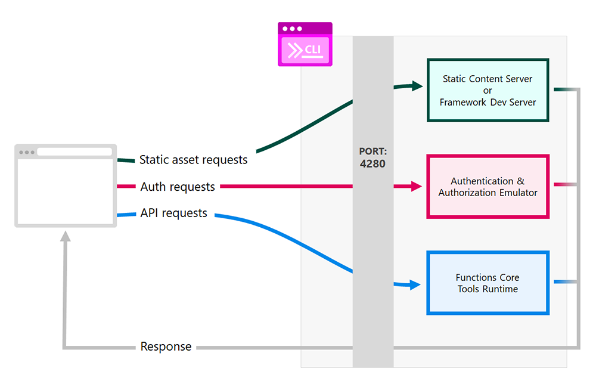

# SWA with B2C tenant & PostgreSQL

## Structure

| folder               | sub-folder                 | content                                                                                                                                                                                                                                                            |
|----------------------|----------------------------|--------------------------------------------------------------------------------------------------------------------------------------------------------------------------------------------------------------------------------------------------------------------|
| [`.github`](.github) |                            | [GitHub workflows](https://docs.github.com/en/actions/using-workflows/about-workflows) (CI/CD)                                                                                                                                                                     |
| [`data`](data)       |                            | Data for development                                                                                                                                                                                                                                               |
| [`docs`](docs)       |                            | Documentation                                                                                                                                                                                                                                                      |
| [`scripts`](scripts) |                            | Scripts for development                                                                                                                                                                                                                                            |
| [`src`](src)         |                            | Source code                                                                                                                                                                                                                                                        |
|                      | [`backend`](src/backend)   | [Managed Azure Functions](https://learn.microsoft.com/en-us/azure/static-web-apps/apis-functions) ([V2 Python Programming Model](https://techcommunity.microsoft.com/t5/azure-compute-blog/azure-functions-v2-python-programming-model-is-generally/ba-p/3827474)) |
|                      | [`frontend`](src/frontend) | [React](https://react.dev/)                                                                                                                                                                                                                                        |

## Infrastructure

See [INFRASTRUCTURE.md](docs%2FINFRASTRUCTURE.md).

## Installation

- Install the Python libraries

```shell
pip install -r ./src/backend/requirements.txt
pip install -r ./src/backend/requirements-dev.txt
```

- Install the Azure Functions Core Tools (macOS)

```shell
brew tap azure/functions
brew install azure-functions-core-tools@4
```

- Install the `swa cli` globally (`-g`) or locally (`-D`) (requires [node@18](https://formulae.brew.sh/formula/node@18))

```shell
npm install -g @azure/static-web-apps-cli
```

If you have any secrets that are required for your Azure Functions, you can provide them
in [local.settings.json](src/backend/local.settings.json).
Here is an example with `POSTGRESQL`:

```json
{
  "IsEncrypted": false,
  "Values": {
    "FUNCTIONS_WORKER_RUNTIME": "python",
    "AzureWebJobsFeatureFlags": "EnableWorkerIndexing",
    "AzureWebJobsStorage": "UseDevelopmentStorage=true",
    "POSTGRESQL_HOST": "{POSTGRESQL_HOST}",
    "POSTGRESQL_USER": "{POSTGRESQL_USER}",
    "POSTGRESQL_PASSWORD": "{POSTGRESQL_PASSWORD}",
    "POSTGRESQL_DATABASE_NAME": "{POSTGRESQL_DATABASE_NAME}"
  }
}
```

## Local Development

You can set up local development for Azure Static Web Apps following
this [link](https://learn.microsoft.com/en-us/azure/static-web-apps/local-development).



- Start the application(s) with the swa cli:

```shell
make start-app
```

- Go to [http://localhost:4280](http://localhost:4280) to access the application served by the CLI.

## Authentication

[Set up authentication in SWA with Azure Active Directory B2C.](docs/AUTHENTICATION.md)

## CI/CD

When you connect your SWA resource with your GitHub repository, a workflow file for CI/CD will be created.
Alternatively, use the template
file: [ci-cd-azure-static-web-app-template.yml](.github%2Fci-cd-azure-static-web-app-template.yml)

## TODO:

- [ ] Once this [issue](https://github.com/Azure/azure-functions-python-worker/issues/1310) is resolved, we can use
  FastAPI as the backend
