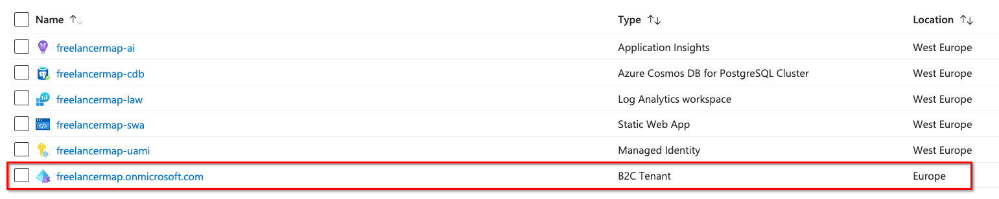
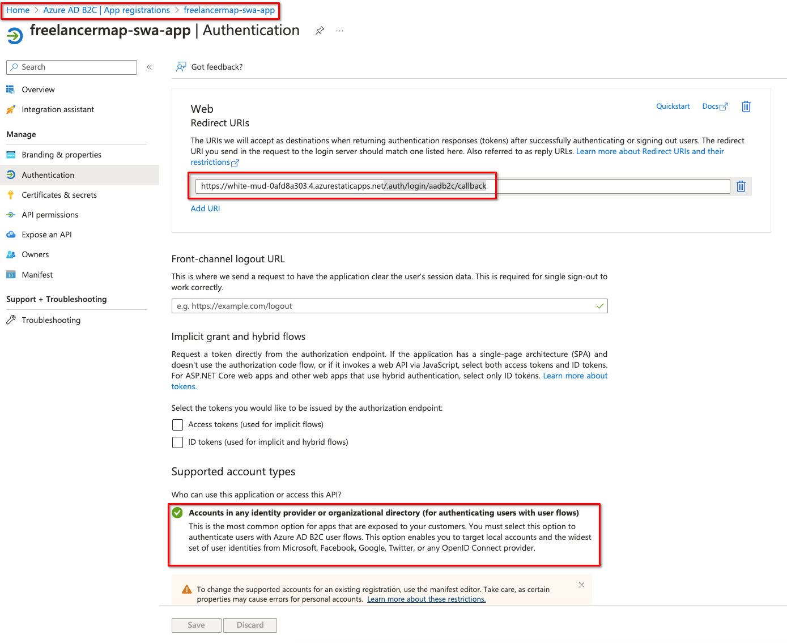
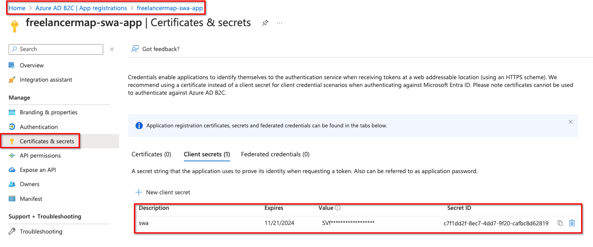
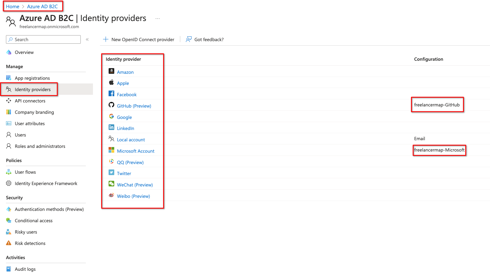
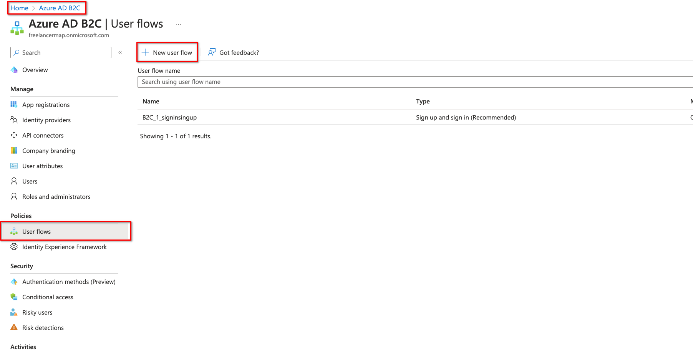
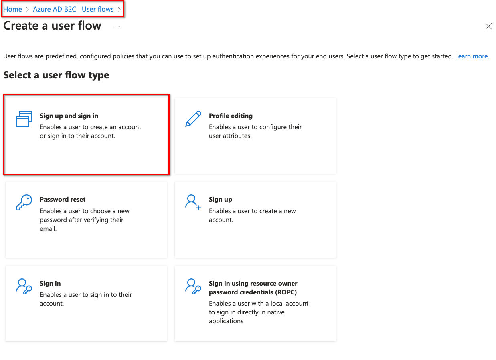
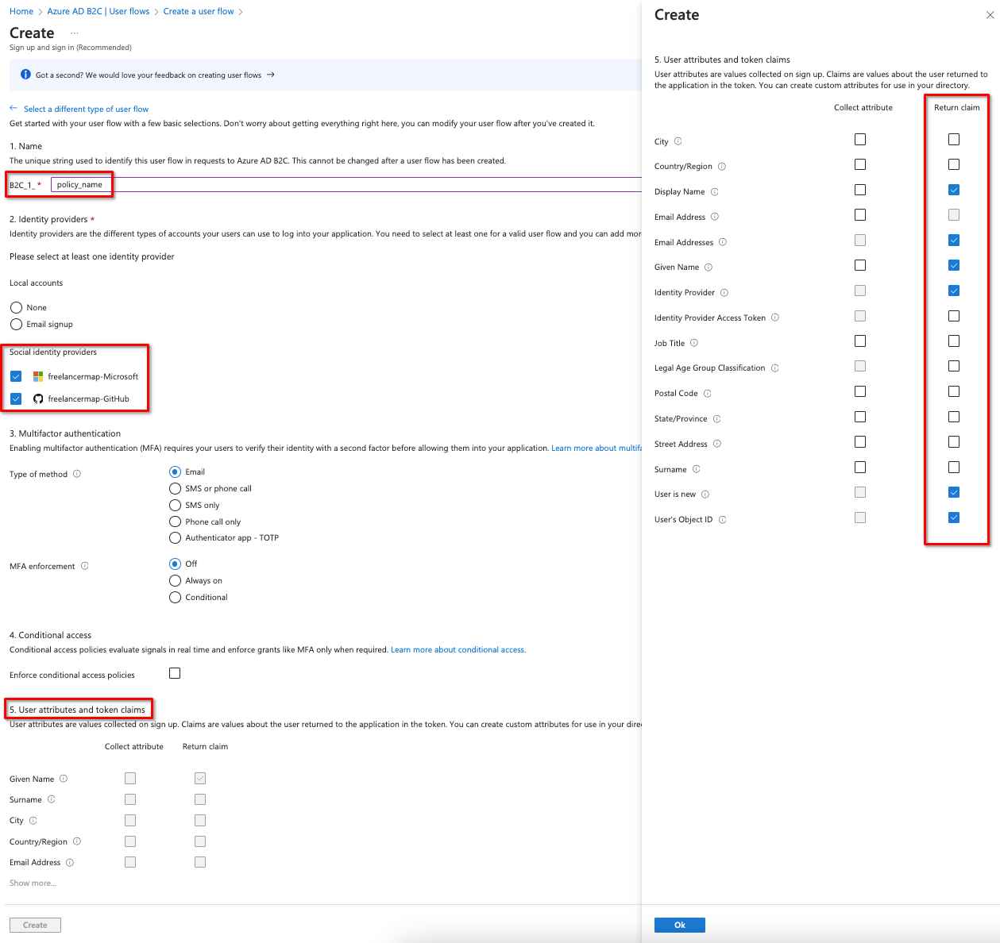
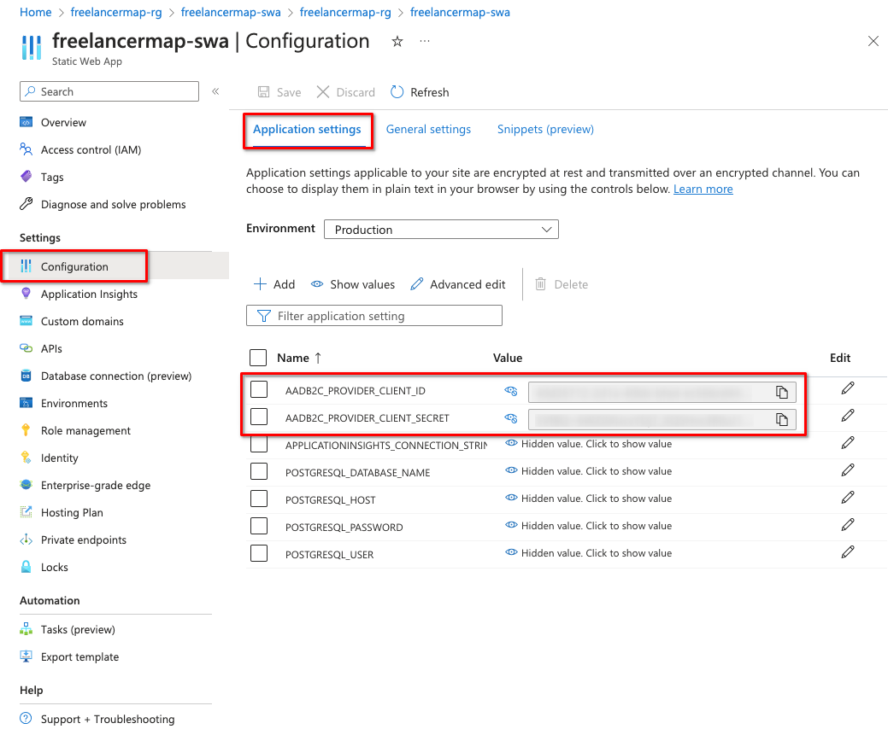

# Set up authentication

Based
on: [Configure authentication in an Azure Static Web App by using Azure AD B2C](https://learn.microsoft.com/en-us/azure/active-directory-b2c/configure-authentication-in-azure-static-app)

## B2C

1. [Create an Azure Active Directory B2C tenant](https://learn.microsoft.com/en-us/azure/active-directory-b2c/tutorial-create-tenant)
   
2. [Register and configure a web application in Azure Active Directory B2C](https://learn.microsoft.com/en-us/azure/active-directory-b2c/tutorial-register-applications?tabs=app-reg-ga)
    - App registration: 
    - Secret: 
3. [Add identity providers](https://learn.microsoft.com/en-us/azure/active-directory-b2c/add-identity-provider)
   
4. [Add a user flow](https://learn.microsoft.com/en-us/azure/active-directory-b2c/tutorial-create-user-flows?pivots=b2c-user-flow)
    - Add User Flow: 
    - Select `Sign in and Sign up` flow: 
    - Configure settings:  Make sure to select the
      **identity providers** you want. Select the **claims** you want to obtain from the user (displayName, email etc.)

## SWA

Configure the Azure Static Wep App

1. Add the `AADB2C_PROVIDER_CLIENT_ID` & `AADB2C_PROVIDER_CLIENT_SECRET` from step 2 of B2C to the application settings
   of the SWA: 
2. Add the identity provider in the [staticwebapp.config.json](../src/frontend/staticwebapp.config.json)

```json
{
  "auth": {
    "identityProviders": {
      "customOpenIdConnectProviders": {
        "aadb2c": {
          "registration": {
            "clientIdSettingName": "AADB2C_PROVIDER_CLIENT_ID",
            "clientCredential": {
              "clientSecretSettingName": "AADB2C_PROVIDER_CLIENT_SECRET"
            },
            "openIdConnectConfiguration": {
              "wellKnownOpenIdConfiguration": "https://{{ TENANT_NAME }}.b2clogin.com/{{ TENANT_NAME }}.onmicrosoft.com/{{ POLICY_NAME }}/v2.0/.well-known/openid-configuration"
            }
          },
          "login": {
            "nameClaimType": "http://schemas.xmlsoap.org/ws/2005/05/identity/claims/name",
            "scopes": [],
            "loginParameterNames": []
          }
        }
      }
    }
  }
}
```

3. Restrict access to API endpoints based on roles

```json
{
  "routes": [
    {
      "route": "/api/user",
      "allowedRoles": [
        "authenticated"
      ]
    },
    {
      "route": "/api/env",
      "allowedRoles": [
        "admin"
      ]
    }
  ]
}
```

If access should only be granted to authenticated users, use the built-in role `authenticated`.
