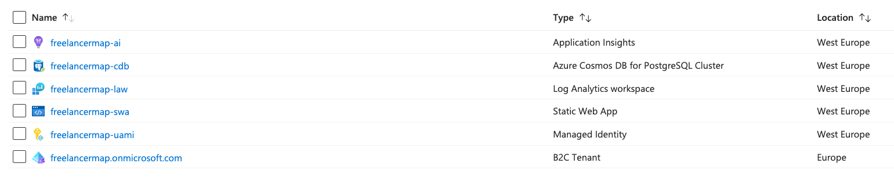

# Azure Infrastructure

## Overview

- B2C Tenant
- PostgreSQL
- Log Analytics Workspace
- User Assigned Managed Identity
- Applications Insights
- Static Web App

## B2C Tenant

See [AUTHENTICATION.md](..%2Fdocs%2FAUTHENTICATION.md)

## PostgreSQL

You can choose any PostgreSQL resource of any cloud provider.
In Azure the cheapest PostgreSQL option right now
is [Azure Cosmos DB for PostgreSQL](https://learn.microsoft.com/en-us/azure/cosmos-db/postgresql/introduction)

## Log Analytics Workspace & Applications Insights

1. Create a Log Analytics Workspace
2. Create an Applications Insights resource referencing the Log Analytics Workspace

## SWA

1. Create a Static Web App in your Azure Subscription:
   
    - Select plan type `Standard`
    - Connect the SWA with your GitHub repository (GitHub Actions workflow file (CI/CD) will be created automatically)
2. Add Applications Settings
   
    - Add `PostgreSQL` settings
    - Add `Application Insights` connection string
    - Add `AADB2C` settings, see [AUTHENTICATION.md](..%2Fdocs%2FAUTHENTICATION.md)
